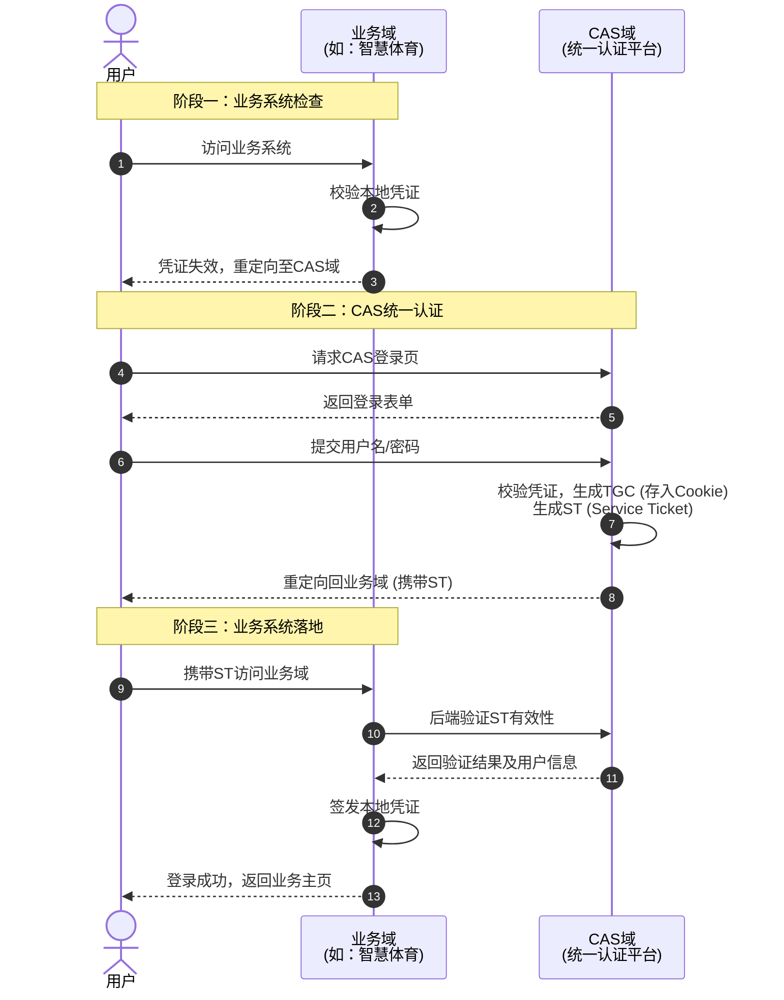
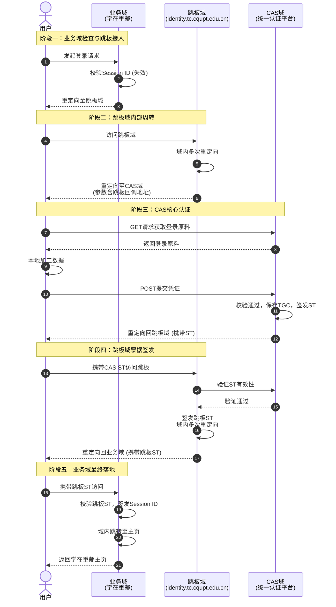

# 重邮统一认证平台

学校的统一身份认证平台本质上是一套**CAS**系统，而其他服务（例如学在重邮、智慧体育门户等）则通过**SSO单点登录**的方式接入。

## 认证流程
我们根据域的类型，大致分为三种：
1. **业务域**：具体的业务，例如**学在重邮**、**智慧体育**等等。
2. **跳板域**：部分业务使用，看起来是老认证系统的兼容层。
3. **CAS域**：统一认证平台核心。

基本流程都是业务域校验凭证，如需登录则重定向到CAS域，然后用户在CAS域登录，CAS域返回一个ticket（ST，Service Ticket），并保存一个ticket到Cookie（TGC，Ticket-Granting Cookie），然后重定向到业务域，业务域向CAS校验ST后，签发凭证给用户。如下：

但部分服务的流程有略微不同，例如**学在重邮**，可能是祖传屎山发力，亦或者是为了兼容，业务域和CAS域并不是直接重定向，而是多了一层中间层，学在重邮在这一层会进行多次域内重定向，但感觉又没有实际的意义（除了可以恶心人），姑且称之为**跳板层**，相关的域称为**跳板域**。

以学在重邮为例，认证流程如下：
用户发起登录→学在重邮（`lms.tc.cupt.edu.cn` 业务域）校验Session ID（学在重邮凭据）→如果失效，则重定向到`identity.tc.cqupt.edu.cn`跳板域→跳板多次域内重定向→重定向到统一认证平台 （`ids.cqupt.edu.cn` CAS域）（一个以跳板域为参数的CAS Url）→用户通过GET获取CAS登录原料→用户加工后POST到相同CAS Url→CAS校验，签发ST，保存TGC→携带ST重定向到跳板→跳板多次域内重定向，并通过CAS ST签发跳板ST→学在重邮业务域校验跳板ST，签发Session ID→业务域内多次跳转到学在重邮主页。如下：

本质上还是同一套CAS SSO方案，但是多次重定向真的太恶心了，并且中途有多次Cookie状态传递，处理起来很麻烦。

## 登录流程
当重定向到`https://ids.cqupt.edu.cn/authserver/login?service={Service URL}`（以下简称`CAS URL`）时，便可以开始登录了。这套系统支持**密码、FIDO、手机验证码、扫码**几种登录方式，这里先研究密码登录。

当`GET`到`CAS URL`时，会返回登录的html页面，其中包含CAS认证参数（包括`execution`、`_eventId`、`lt`、`cllt`、`dllt`等），以及登录表单。登录时，用户名通过明文发送，而密码使用一种*很有意思*（但并不安全，属于是反面案例了）的加密方式加密后发送。

加工好所有参数后，使用表单`POST`到`CAS URL`，其会响应`302`重定向，重定向的URL中便包括了签发的`ST`，然后离开CAS域，登录完成。

如果携带了`TGC`，且其中的`TGT`有效，则`GET`到`CAS URL`时会直接签发`ST`，响应302重定向。

> 顺带吐槽一句，统一认证平台还在用表单来POST数据，DOM Element id还有重复的，也是牛大了。

### 加密流程
**输入**：`pwd`（用户明文密码），`salt`（从页面隐藏input标签获取）

1. 随机生成`IV`（16字节，初始向量）和`prefix`（64字节）。
2. 拼接`prefix` + `pwd`，得到`plainText`。
3. 以`salt`作为密码，随机`IV`作为`IV`，使用`AES-CBC-128bits/PKCS#7 Padding`加密`plainText`，得到`cipherText`（即为`encryptedPwd`）。

#### 啸巧思
因为`AES-CBC`是基于*块*的加密，`IV`仅影响第一个块的解密，而后续块的解密依赖前一个块的密文，而在这套系统中，由于`prefix`的引入，使得真正的密码始终存在于第5个块及其之后，所以服务器不需要正确的`IV`也可以解密出正确的密码。

但这也意味着，我们的密码在服务器是明文存储的。